# Amber - Hippotherapy measurement tool

## Table of Contents

Overview

[Who is this app for?](#who-for)

[What does it do?](#what-do)

Screen Mockup

[Screen Mockup](#mockup)

Features

[Known Bugs](#known-bugs)

[Future features](#future-features)

Data Model

[Entity Model](#entity-diagram)

[Entity Relationship Model](#erd)

[Python Structure](#python-structure)

UX

[Storyboard](#storyboard)

[Personas](#personas)

[Customer Journey Maps](#cjm)

[Wireframes](#wireframes)

[Flow Chart](#flow-chart)

[Site Map](#site-map)

[Accessibility](#accessibility)

Design Decisions

[Colours](#colours)

[Usability](#usability)

Software Development Process

[Agile Methodology](#agile)

[Project Planning](#planning)

[Version control](#git)

[Testing](#testing)

[Documentation](#documentation)

[Deployment](#deployment)

Technology Used

[Technology Used](#technology)

Contributing

[Clone](#clone)

[Fork](#fork)

[Clone versus Fork](#clone-fork)

Credit

[Credit](#credit)

## Overview
Hippotherapy is the practise of performing Occupational Therapy exercises, whilst mounted on a horse.  Hippotherapy improves neurological function, sensory processing by providing carefully constructed graded motor and sensory input.  It is during ambulation that the horse provides rhythmic movement which in turn stimulates the anterior, and posterior swinging movements, this encourages proper balance, posture, and strengthening of core muscles which are required for daily functional tasks from climbing stairs, writing, speaking, listening and engaging in the world successfully. 

Hippotherapy can also shorten recovery time and ensure correct development of the paraspinal muscles.  Multifaceted swinging movement and rhythm of the horse’s gait effects the bones of the patient’s girdle twice as strongly as the gait of the individual patient.  The therapeutic benefit needs to be measured and Natalia has created an application that measures this precisely.   

### Who is this app for?
This web-based app is for all Occupational Therapists who are involved in providing Hippotherapy sessions to clients.
 
 
### What does it do?
Using Amber as a Hippotherapy measurement tool will serve to prove the therapeutic benefits of Hippotherapy as an essential and much required occupational therapy for people with special needs, brain injuries, etc.; shortening the recovery time of medical and surgical treatment. 
  
 
### How does it work
Amber captures, documents and records Key Performance Indicators for individual Hippotherapy sessions and displays the results in an straightforward manner.

## Screen Mockup

## Features

### Known Bugs

* Javascript is used to position the "My Account" and "Logout" links when the page is loaded.  This depends on the width of the screen when the application is first loaded.  If a user views the Amber application on a tablet and changes the orientation, then the layout of these links will be in the wrong place.

### Future features
Since Amber is a "real-life" project, this section will be used to "de-scope" some of the Use Cases and User Stories.  This will provide a Minimum Viable Product for the end-user which will also meet the criteria for examination by Code Institute. 

* Add long-term goals
	* Allow the Occupational Therapist to record long-term goals which she will aim to use Hippotherapy to reach for the client.
* View long-term goals
	* Allow the Occupational Therapist to view the long-term goals for a particular client 
* Set Session notes
	* Allow the Occupational Therapist to record notes for a particular session. 
* View Session notes
	* Allow the Occupational Therapist to see the Session notes for a particular session. 
* Print Charts
	* Allow the Hippotherapy Analyst to print out charts for a course of Hippotherapy sessions concerning a particular client.
* Maintain Configuration
	* Allow the Admin to add, edit and delete static information (such as hat sizes, etc.).
* Maintain Functional Skills
	* Allow the Admin to add, edit and delete functions, skills within those functions, as well as the hints relating to each functional skill.

## Data model

### Entity Diagram

### Entity Relationship Diagram

### Python structure

## UX

### Storyboard

### Personas

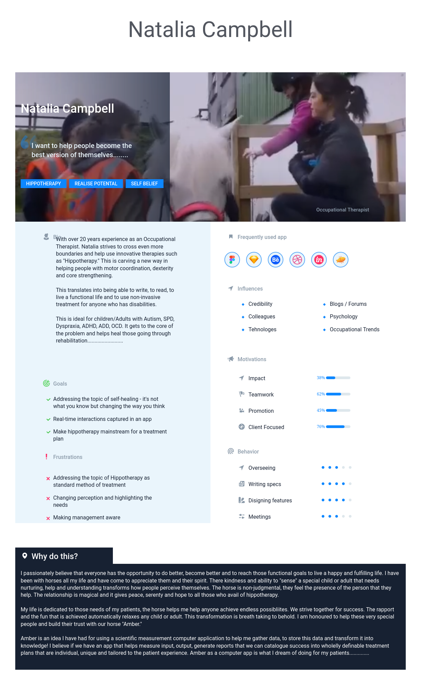

### Customer Journey Maps

### Wireframes

**Login**

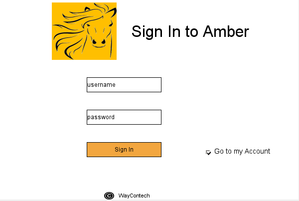

**Home Page**

**Add Client**

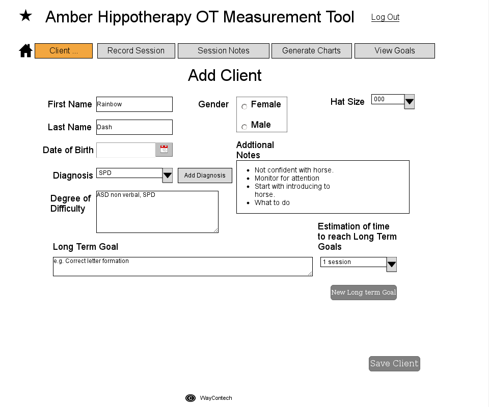

**Select Client**

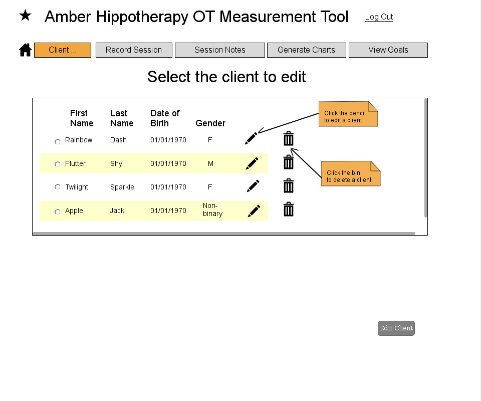

**Edit Client**

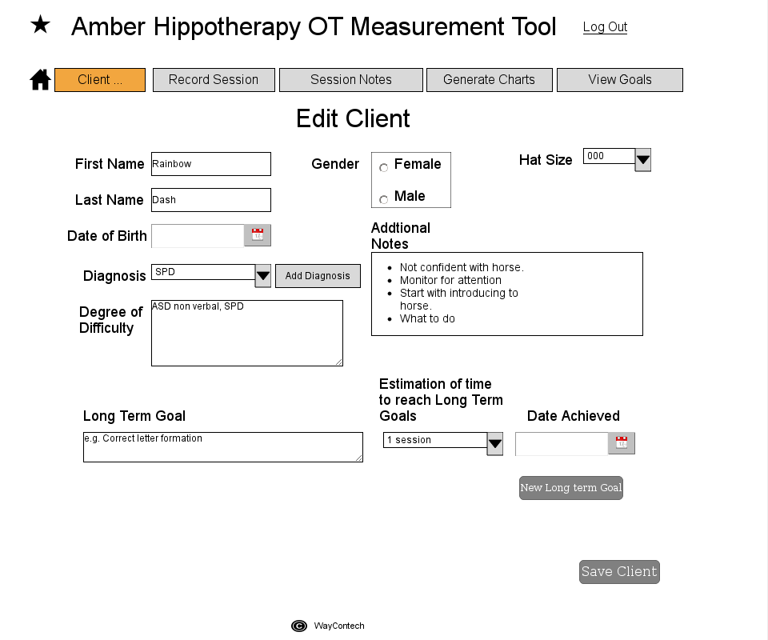

**Record a Session**

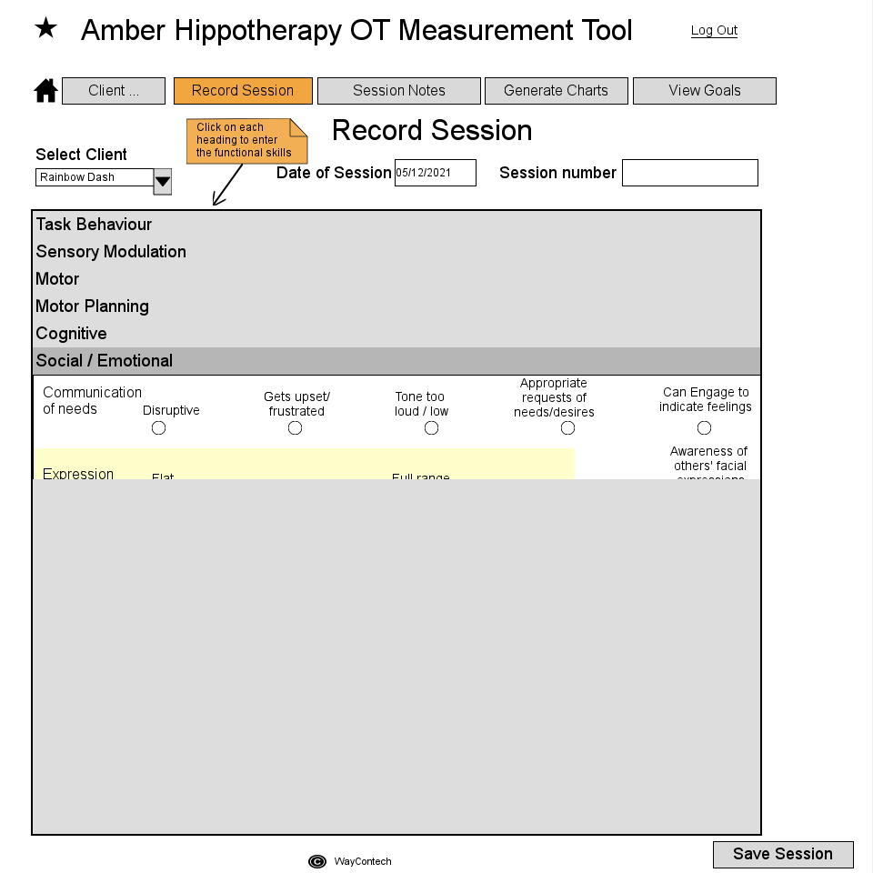

**Generate Charts**

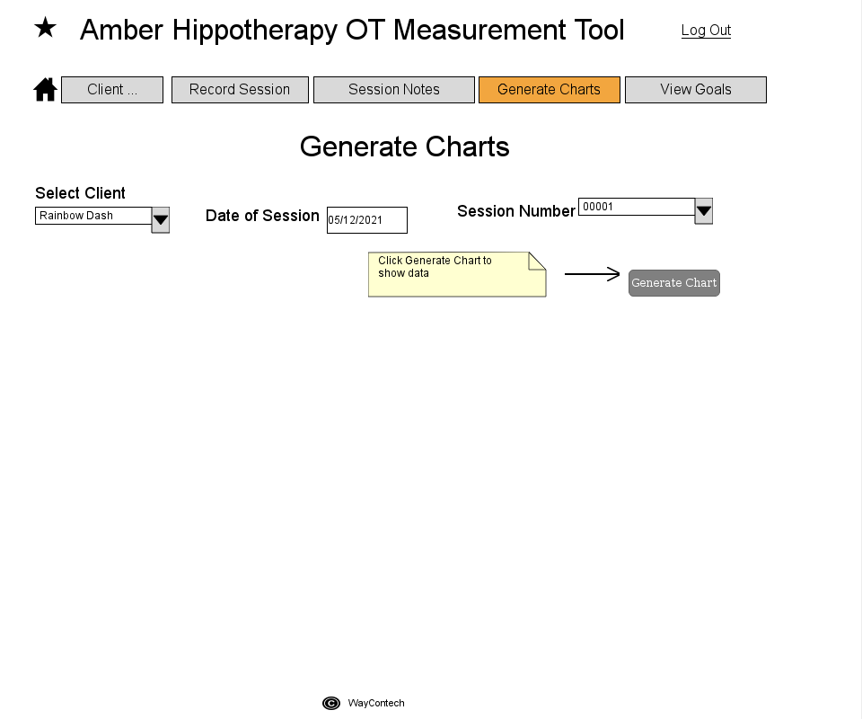

**Edit Account**

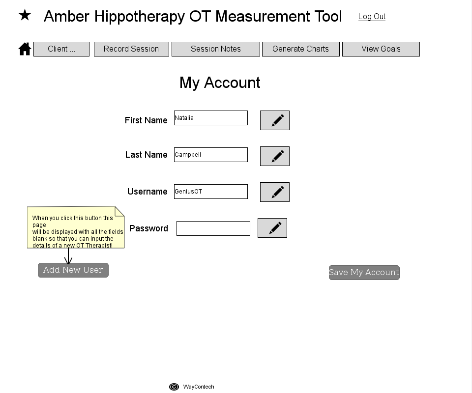

**Add Diagnosis**

### Flow charts

#### Key

|Type|Symbol|
| --- | --- |
|Input | |
|Output ||
|Process ||
|Code ||

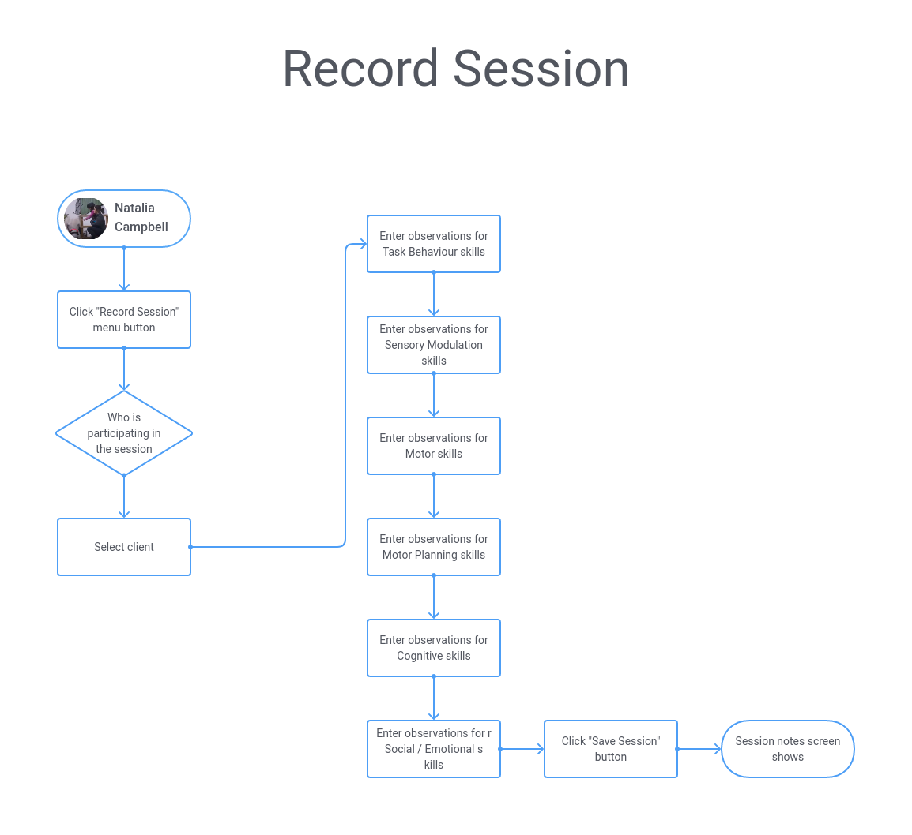

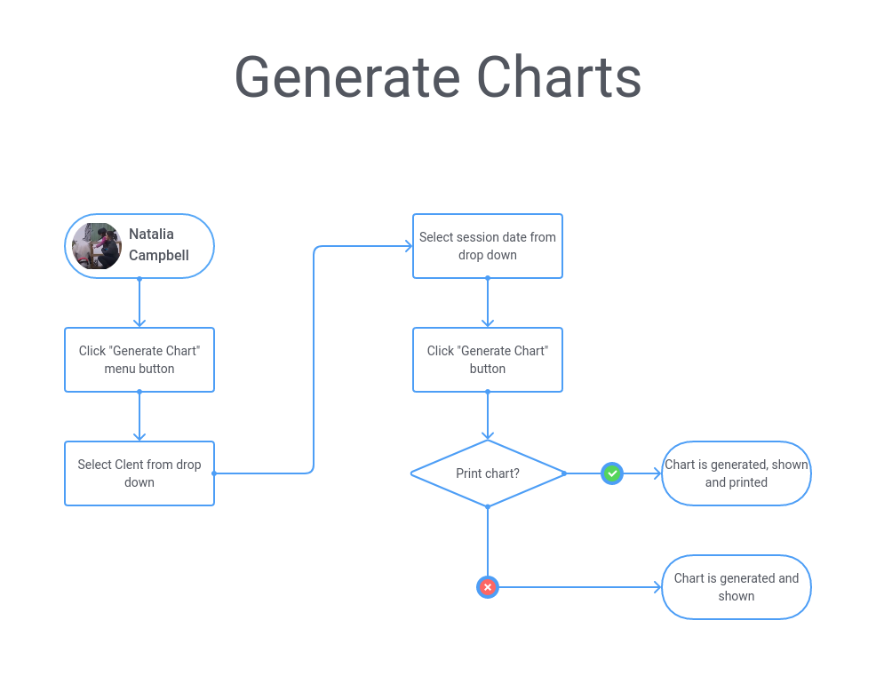

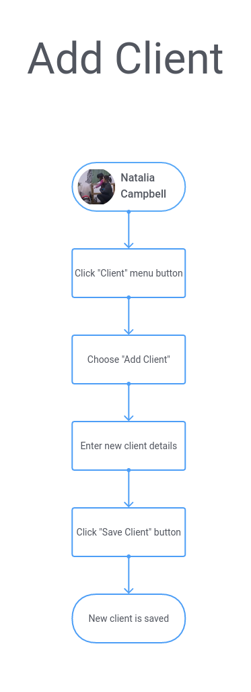

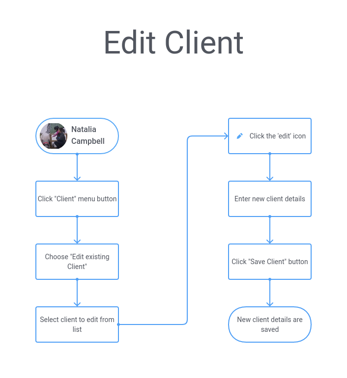

### Site Map

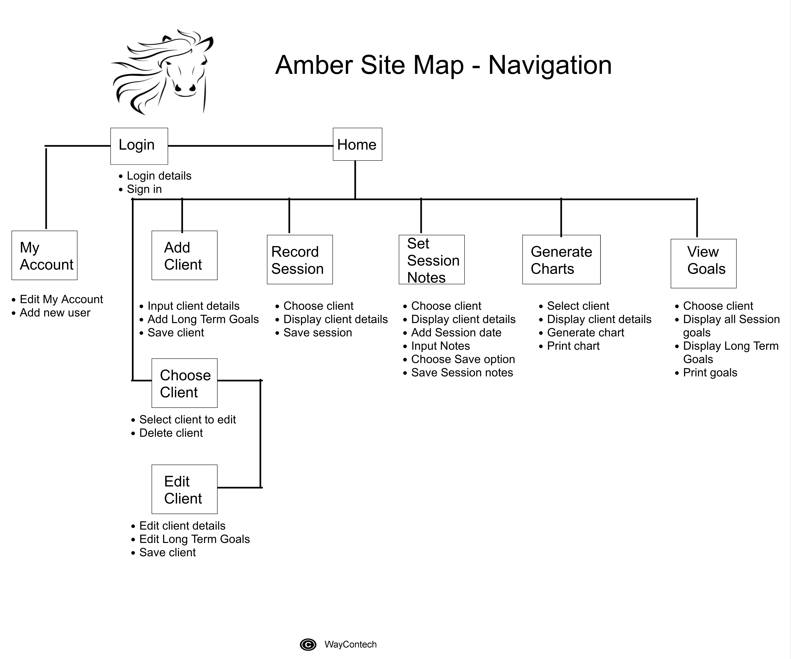

### Accessibility

## Design Decisions

### Colours
The main colours for the Amber application were deliberately chosen to invoke specific emotional reponses from the user.

*white* - Amber is first and foremost a clinical application.  Therefore the background is deliberately set to white.  White is perceived to be a sterile and clinical colour.  The predominance of this colour on every page enforces this idea of Amber being a tool for serious clinicians.

*orange* - Orange is associated with both energy and warmth.  This colour is used throughout the Amber application to invoke a welcoming feeling from the user, as well as to show that there a certain vibrancy about the application.

*blue* - Blue is a colour that makes people feel safe.  Websites often use the colour blue when they want to make their users trust them.

The use of colours in the Amber application should make the user feel welcomed and trusting.  Whilst at the same time the user knows that this is not a "fun" app, but a serious tool that will be used by professionals.

### Usability
- **Suitability for purpose**
    
- **Ease of use**
    
- **Information Display** 
    

## Software Development Process

### Agile methodology
The use cases were arranged as Epics, the Epics were broken down into User Stories.  Acceptance criteria were developed for every User Story.

[Trello](https://trello.com/b/0wEVCThe/amber-p4-ci-project) was used as the Agile tool for managing this project.  Each User Story was embodied in a trello card.  Each of these cards was added to a Kanban board.  The Kanban board was set up with a number of lists:

* Story
* ToDo
* Doing always - iteration
* In Process (Code the ... / Test the ...)
* Testing
* Code review
* Done

When a Story is being coded it is moved from the **ToDo** list into the **In Process** list.  When the code is finished for a story it is moved into the **Testing** list.  Once a story has been tested it is moved to the **Code Review** list.  When the code has been reviewed with the mentor is it moved to the **Done** list and is completed.

At the end of the project, all User Stories will be in the **Done** list and the project will be finished.

### Project Planning
The Amber project's User Stories have been allocated into Sprints.  The stories in each Sprint will go through the full process of *ToDo* **>** *In Process* **>** *Testing* **>** *Code Review* **>** *Done*, before the next Sprint begins.

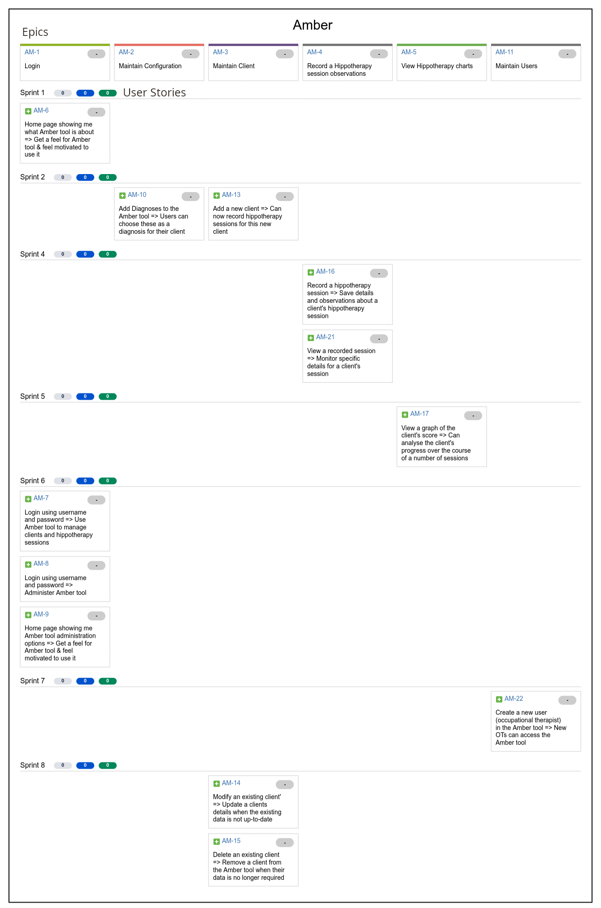

### Version Control 
**Git** is used for version control of this project

- Git commit message prefix convention denoting the type of change made in this commit:
    
	- DOC: Documentation
    - FEAT: Feature
    - FIX: Bugfix
    - STYLE: Changes to CSS
    - REFACTOR: Where changes are made that do not change the functionality.
    
- Git messages will be no longer than 50 characters long.

**GitHub** is used as the central version control repository for this project.

### Testing 
Testing is documented in the [Testing document](documentation/test/TESTING.md)

### Bug Fixes
**BUG:**
TemplateSyntaxError at /
Could not parse the remainder: '('static', filename='css/style.css')' from 'url_for('static', filename='css/style.css')'
**FIX:**
Switched from using Flash syntax `href="{{ url_for('static', filename='css/style.css') }}"` to using Django syntax `href=""`.

**BUG:**
TemplateSyntaxError at /
Could not parse the remainder: '('home')' from 'url_for('home')'
**FIX:**
Switched from using Flash syntax `href="{{ url_for('home') }}"` to using Django syntax `href=""`.

**BUG:**
TemplateSyntaxError at /
Could not parse the remainder: '('static', filename='js/script.js')' from 'url_for('static', filename='js/script.js')'
**FIX:**
Switched from using Flash syntax `src="{{ url_for('static', filename='js/script.js') }}"` to using Django syntax `src=""`.

**BUG:**
NoReverseMatch at /
Reverse for 'client' not found. 'client' is not a valid view function or pattern name.
**FIX:**
Removed non-existant links from the base.html template.

### Validation
Source code was validated with [PEP8 Validator](http://pep8online.com/).

### Documentation  

- README.md :  Comprehensive overview of the Amber application detailing how it works, what its features are, the technologies involved and all the design decisions that were made in creating this web-based application.
- [Vision doc](static/documentation/requirements/vision-doc-amber.docx) :  Business needs and feature list.
 

### Deployment
This project is deployed to [Heroku](https://amber-ci.herokuapp.com/)

1. Push the code to Github using `git push`.

2. Go to the [Heroku Dashboard](https://dashboard.heroku.com/apps)

3. In the Heroku Dashboard, click on the *Create new app* button.

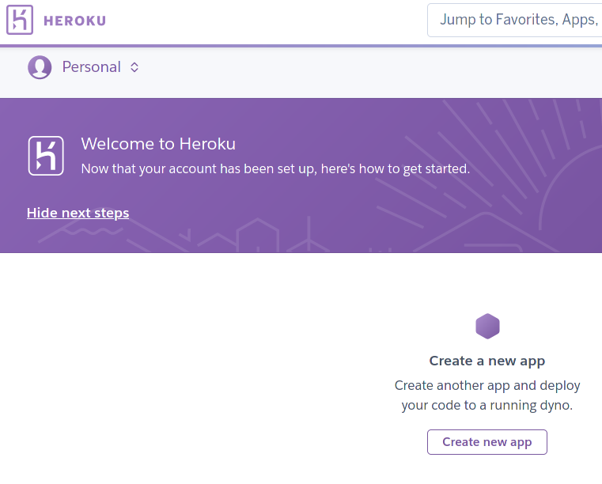

4. Enter an app name (*amber-ci*) and region (*Europe*) and click the *Create app* button.

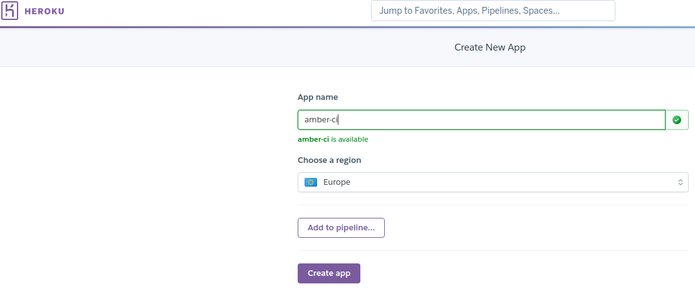

5. Click on *Settings* tab

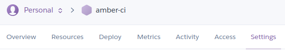

6. In the 'Config Vars' section, click on *Reveal Config Vars*.  Add a key of **PORT** and a value of **8000**.  Click *Add* button.

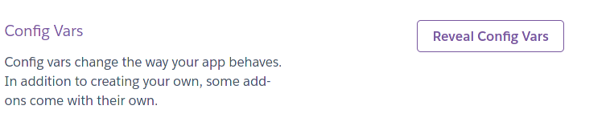
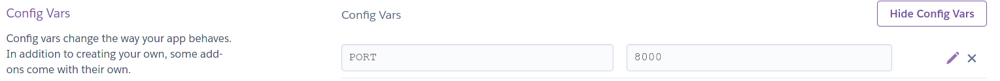

7. Click on *Deploy* tab.

8. Choose Deployment Method *Github*.

9. In *Connect to Github* section, type **Amber** in the *repo-name* box and click *Search* button.

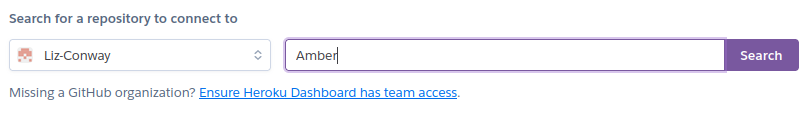

12. Click the *Connect* button next to **Liz-Conway/Project-4-Amber**.

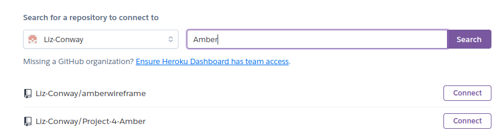

13. Heroku app is now connected to the Github repository.

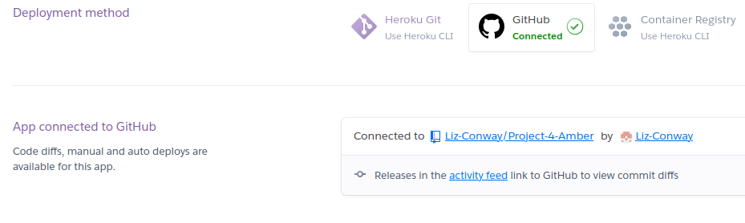

14. Go to *Manual deploy* section, ensure the branch to deploy is **main**.  Click on *Deploy Branch* button.

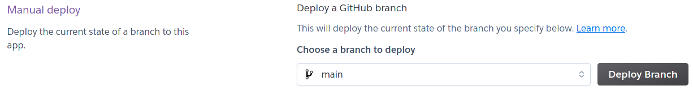

15. Once the app is successfully deployed click on the *view* button, or navigate to [Amber application](https://amber-ci.herokuapp.com/) to run the application.

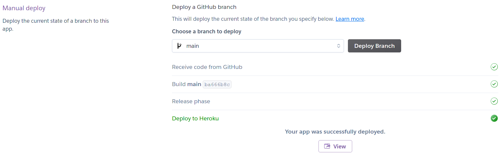

16. Once the app has been deployed you can access it by navigating to [Amber application](https://amber-ci.herokuapp.com/) to run the application.

## Technology Used

### Some of the technology used includes:

* [Django](https://www.djangoproject.com)
	- **Django** is a high-level Python web framework that is used to develop the Amber application.
* [Heroku](https://heroku.com/)
    - **Heroku** is used to host and run the Amber application.

## Contributing

### Clone

1. Firstly you will need to clone this repository by running the `git clone https://github.com/Liz-Conway/Project-4-Amber.git` command

2. After you've that you'll need to make sure that you have a package manager such as **npm**  installed
   You can get **npm** by installing Node from [here](https://nodejs.org/en/)
   
3. Make sure that you have **python 3** installed. You can install this by running the following: `npm install -g python3` .  This also may require sudo on Mac/Linux

4. Make sure that you have **Django** installed. You can install this by running the following: `pip install django`  This also may require sudo on Mac/Linux
 
5. Once **Django** is installed run `python3 manage.py runserver` in the root directory (the one where manage.py is).
 
6. Navigate to http://127.0.0.1:8000/amber-ci in your browser to run the Amber application.
 
7. Make changes to the code and if you think it belongs in here then just submit a pull request.

### Fork

1. Log into [Github](https://github.com/)

2. Search for **Amber** and choose to go to `Liz-Conway/Project-4-Amber`.

3. Click on the *Fork* button on the top right hand side of the screen.
 
4. This will make a copy of **Amber** in your github account.
 
5. In your version of Amber click on the `Code` button and copy the clone text.
 
6. Then, you will need to clone this repository by pasting the command you just copied into a terminal window on your computer and running it.  This will create a copy of Amber from your github account onto your computer.
 
7. After you've done that you'll need to make sure that you have a package manager such as **npm**  installed
   You can get **npm** by installing Node from [here](https://nodejs.org/en/)
 
8. Make sure that you have **python3** installed. You can install this by running the following: `npm install -g python3`  This also may require sudo on Mac/Linux

9.  Make sure that you have **Django** installed. You can install this by running the following: `pip install -g django`  This also may require sudo on Mac/Linux
 
10. Once **Django** is installed run `python3 manage.py runserver` in the root directory (the one where manage.py is).
 
11. Navigate to http://127.0.0.1:8000/amber-ci in your browser to run the Amber application.
 
12. Make changes to the code and run `git push` to save those changes to your github account.

### Cloning versus Forking
The major difference between cloning and forking is where your updates go when you perform a `git push`.

With cloning you are pushing the updates to the `Liz-Conway/Project-4-Amber` repo on github.

With forking you are pushing the updates to your own Amber repo on github.

## Credit

| Code purpose                    | Author               | Link                                                                                 |
| ------------------------------- | -------------------- | ------------------------------------------------------------------------------------ |
| Custom Reset          | Josh Comeau             | https://www.joshwcomeau.com/css/custom-css-reset/   |
| Host static files in Cloudinary | https://cloudinary.com/blog/author/nadav_soferman             | https://cloudinary.com/blog/using_cloudinary_to_manage_all_your_website_s_assets_in_the_cloud   |
| Validate a date string          | kite.com             | https://www.kite.com/python/answers/how-to-validate-a-date-string-format-in-python   |
| Skip first line in a file       | kite.com             | https://www.kite.com/python/answers/how-to-skip-the-first-line-of-a-file-in-python   |
| Format dates in Python          | Nicholas Samuel      | https://stackabuse.com/how-to-format-dates-in-python/                                |
| Python Errors                   | TutorialsTeacher.com | https://www.tutorialsteacher.com/python/error-types-in-python                        |
| Check if a string is an integer | Pratik Kinage        | https://www.pythonpool.com/python-check-if-string-is-integer/                        |
| Run a python file from another  | Delftstack           | https://www.delftstack.com/howto/python/python-run-another-python-script/            |
| How to colourise text in python | Stack Overflow       | https://stackoverflow.com/questions/287871/how-to-print-colored-text-to-the-terminal |
|How to pad out strings in Python| Delftstack |https://www.delftstack.com/howto/python/python-pad-string-with-spaces/|
