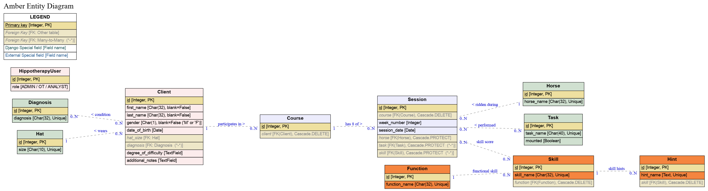

# Amber - Hippotherapy measurement tool

## Table of Contents

Overview

[Who is this app for?](#who-for)

[What does it do?](#what-do)

Screen Mockup

[Screen Mockup](#mockup)

Features

[Known Bugs](#known-bugs)

[Future features](#future-features)

Data Model

[Entity Model](#entity-diagram)

[Entity Relationship Model](#erd)

[Python Structure](#python-structure)

UX

[Storyboard](#storyboard)

[Personas](#personas)

[Customer Journey Maps](#cjm)

[Wireframes](#wireframes)

[Flow Chart](#flow-chart)

[Site Map](#site-map)

[Accessibility](#accessibility)

Design Decisions

[Colours](#colours)

[Usability](#usability)

Software Development Process

[Agile Methodology](#agile)

[Project Planning](#planning)

[Version control](#git)

[Testing](#testing)

[Documentation](#documentation)

[Deployment](#deployment)

Technology Used

[Technology Used](#technology)

Contributing

[Clone](#clone)

[Fork](#fork)

[Clone versus Fork](#clone-fork)

Credit

[Credit](#credit)

## Overview
Hippotherapy is the practise of performing Occupational Therapy exercises, whilst mounted on a horse.  Hippotherapy improves neurological function, sensory processing by providing carefully constructed graded motor and sensory input.  It is during ambulation that the horse provides rhythmic movement which in turn stimulates the anterior, and posterior swinging movements, this encourages proper balance, posture, and strengthening of core muscles which are required for daily functional tasks from climbing stairs, writing, speaking, listening and engaging in the world successfully. 

Hippotherapy can also shorten recovery time and ensure correct development of the paraspinal muscles.  Multifaceted swinging movement and rhythm of the horse’s gait effects the bones of the patient’s girdle twice as strongly as the gait of the individual patient.  The therapeutic benefit needs to be measured and Natalia has created an application that measures this precisely.   

### Who is this app for?
This web-based app is for all Occupational Therapists who are involved in providing Hippotherapy sessions to clients.
 
 
### What does it do?
Using Amber as a Hippotherapy measurement tool will serve to prove the therapeutic benefits of Hippotherapy as an essential and much required occupational therapy for people with special needs, brain injuries, etc.; shortening the recovery time of medical and surgical treatment. 
  
 
### How does it work
Amber captures, documents and records Key Performance Indicators for individual Hippotherapy sessions and displays the results in an straightforward manner.

## Screen Mockup

## User Stories

The user stories have been divided into different epics:

1. Login
2. Maintain Configuration
3. Maintain Client
4. Record Hippotherapy Session
5. View Hippotherapy Charts
6. Maintain Users

### User Roles

A number of different roles have been created for the Amber application.
* SuperUser
    This user role can access all the Admin functions and can also access the Django admin panel.
* Admin
    This user role can access the features in the Maintain Configuration epic.  I.E. Add Diagnosis and Add User.
* Hippotherapy Analyst
	This user role can access the View Session and Generate Charts features.
* Occupational Therapist
	This user role can access the features that the Hippotherapy Analyst can acess and also the Add Client, Edit Client and Record Session features.

All user roles can access the Login, Logout and My Account features.

## Features

### Existing Features

#### Inital Landing page

This is where the user arrives on first entering the site.  The only option a user has is to login to the amber system.  This page sets the theme for the application, with a Logo which when clicked will bring the user back to the home page.

#### Login

Access to the Amber application is achieved by using the Login feature.

Supporting page - **Login page**

#### Navigation
Each page has a header at the top of the page which contains a logo and a NavBar.

The available links in the navbar depend on what role the Admin has allocated to the logged in user's account.  This is **not** a self-registering site.  The Admin is responsible for setting up user accounts and granting each account the appropriate access role.

All user roles will have access to 'My Account' and 'Logout' links once logged into the Amber application.

On small screen devices the NavBar is accessible by clicking the well recognised "hamburger" icon.  The user is shown a responsive menu on small screen devices.  

On any page if the user clicks the logo they will be redirected to the Amber home page.  The benefit of this is that it is a consistent behaviour across the entire website.  Also every NavBar has a "Home" link which will also always give the user the option to return to the home page of the Amber application.  This means that the user can always get back to the home page, no matter where they are in the application.

#### Logout

All logged in users, regardless of their role, can log out of the Amber application.  The logout feature asks the user to confirm that they want to logout.  This puts control in the hands of the user as they have more options, and will help prevent 'accidental' logouts.  This additional control will improve the user experience for logged in users.

Supporting page - **Logout page**

#### User Roles

In the Amber web application there are 4 roles that a user can log in as:
* SuperUser
* Admin
* Occupational Therapist
* Hippotherapy Analyst

Depending on the role assigned to the user, when they log in they will see a similar page but with different role-specific options.

#### Admin functionality

When logged in with an Admin role the user has access to the 'Add Diagnosis' and 'Add User' features.

Supporting page - **Admin home page**

**1  Add Diagnosis**
This feature allows an Admin user to create new diagnoses for use in the Amber application.  This is important because each client attending a hippotherapy session will have some issue that the hippotherapy is helping the client to cope with.  Without an appropriate diagnosis to choose, the Occupational Therapist cannot record accurately what is ailing the client.  This will have an impact, since in future sessions, the actual diagnosis will be used by the Occupational Therapist to guide what activities are undertaken during the session.

By giving the Admin the option to input their own diagnoses, the Amber application gives the Admin and the Occupational Therapist a sense of control over the application.  Occupational Therapist users will have appropriate and meaningful diagnoses to choose from, rather than being restricted by someone elses list of diagnoses some of which may be completely inappropriate.  Having this sense of control will improve the user experience for both Admin users and Occupational Therapist users.

Supporting page - *Add Diagnosis page*

**2  Add User**

The only way for a new user to be able to use the Amber application is for an Admin user to add them as a new user.  The Admin will have to select which access role to give to each new user.  This will give the Admin user a feeling of control, as not just anyone can get access to the application.  The Admin will know who can access the Amber application and what access they will have.

Supporting page - *Add User page*

#### SuperUser Functionality

The superuser role grants extra privileges that a user with Admin role does not have.  In the Amber application the superuser has an additional feature available.  This is the 'Maintain Configuration' feature.  On clicking this navigation link the superuser is redirected to the Django Admin panel.  Within this Admin panel the superuser can add, modify and delete objects of every model within the Amber application, including users.

Supporting page - *Superuser home page*

#### Hippotherapy Analyst Functionality

The Hippotherapy Analyst is only concerned with viewing information that the Amber application has captured.  The two features the Hippotherapy Analyst will use are 'View Session' and 'Generate Charts'.

Supporting page - **Hippotherapy Analyst home page**

**1 View Session**

This is a key feature of the Amber application.  This benefit of this feature is that a Hippotherapy Analyst or Occupational Therapist can retrieve the information that has been stored in the application.  The user needs to be able to see what scores a client ahieved for a chosen session.  This will allow the user to make informed decisions on the client's progress.  Knowing how the client is progressing will allow the Occupational Therapist to tailor future sessions to maximise the client's improvements.

**1a Select Client**
A list of clients is shown and the user picks one of the clients using the button on the same row as the client of interest.  As well as the name the Amber application shows the date of birth, gender and first diagnosis of each client to help the user to distinguish between clients who might have the same name.

On smaller devices the client list only shows name, date of birth and gender.  This is due to the limited screen real estate on smaller devices.

The value of this feature comes from the fact that you need to view a session for a particular client.  This page gives the user the option to select a client whose session they wish to view.

Supporting page - *Select client page*

**1b Select Session**
Once the client has been chosen a list of sessions for that client is shown.  As well as the session date, the session number is shown.  

The way hippotherapy sessions are organised is that a client signs up for a course of treatments.  Each treatment within a course is called a hippotherapy session.  Hippotherapy sessions are usually given approximately one week apart.  

In the Amber application, each course is given a unique course number.  Each hippotherapy session is identified by a combination of its course number and a week number.  Week numbers for a single course are incremented, starting at one.  For example, for a course with an id of 216 running for 8 treatment sessions, each session would be identified as :
* 	216/1
* 	216/2
* 	216/3
* 	216/4
* 	216/5
* 	216/7
* 	216/8

The Occupational Therapist/Hippotherapy Analyst picks one of the sessions by clicking/tapping on the radio button on the same row as the session they wish to view.  Each session is identified by its date and session number.

The session number shown on the select session page consists of a Course number and the week number.  In the image below three sessions are shown for Course number 1.  The first session is for course 1, week 1 and is shown as "**Session :  1/1**".  The second session is for course 1, week 2 and is shown as "**Session :  1/2**".   The third session is for course 1, week 3 and is shown as "**Session :  1/3**". 

The value of this feature comes from the fact that you need to select a session in order to view it.  This page gives the user the option to select which exact session they wish to see details for.

Supporting page - *Select Session page*

**1c View Session**
Once the user clicks the "Select this session" button the Amber application shows a page detailing:
* the client who undertook the session
* the date the session ran on
* the session number assigned to this session
* the horse used in the session
* any tasks performed by the client during the session
* the scores given by the Occupational Therapist for the session.

Scores are given for a variety of skills which the client has demonstrated throughout the treatment session.  The Occupational Therapist will have given each skill a score between 1 and 5 inclusive.  Each skill is part of a particular function.  In the "Session Scores" table below you can see each function and its related skills are grouped together.

The functions and their related skills are :
| Function | Skill |
| --- | --- |
| Task Behaviour | Regulation Engagement Motivation Frustration Tolerance |
| Cognitive | Following Directions Concentration Problem Solving Intention Working Memory |
| Motor Planning | Planning Sequencing Praxis - Execution |
| Motor | Postural Control / Balance Proximal Joint Stability BiLateral Coordination Body Awareness Fine motor |
| Sensory Modulation | Proprioception Vestibular Tactile Auditory Visual Olfactory |
| Social Emotional | Communication of needs Expression Eye Contact Joint Attention Confidence |

The benefit of this feature is that an Occupational Therapist or Hippotherapy Analyst can view historical information about previous treatment sessions for their clients.  This is key information which can be used to measure improvements and make plans for further treatment sessions.

Supporting page - *View Session page*

**2  Generate chart**

This is a key feature of the Amber application.  This benefit of this feature is that a Hippotherapy Analyst or Occupational Therapist can get a visual representation of how a client is progressing over the duration of a course.  A course typically runs over 8 weeks with one treatment session each week.

**2a Select Client**
A list of clients is shown and the user picks one of the clients using the button on the same row as the client of interest.  As well as the name the Amber application shows the date of birth, gender and first diagnosis of each client to help the user to distinguish between clients who might have the same name.

On smaller devices the client list only shows name, date of birth and gender.  This is due to the limited screen real estate on smaller devices.

The value of this feature comes from the fact that you need to view a session for a particular client.  This page gives the user the option to select a client whose session they wish to view.

Supporting page - *Select client page*

**2b Select Course**

Once the client has been chosen a list of courses for that client is shown.  The course number is show beside the radio button for that course.  In addition the date and week number of both the first session for this course and the last session for this course are shown.  

The way hippotherapy sessions are organised is that a client signs up for a course of treatments.  Each treatment within a course is called a hippotherapy session.  Hippotherapy sessions are usually given approximately one week apart.  

The user picks one of the courses by clicking/tapping on the radio button on the same row as the course they wish to generate the chart for.

The benefit of this feature is that it allows the user to select the course that they want to see the graph for.

Supporting page - *Select Course page*

**2c Generate Chart**

When the user clicks on the "Select this course" button a chart is generated by totalling up all the skill scores for each function.  Each function has a different number of skills, so in order to give an accurate depiction of the scores, each function score is converted to a percentage of the total score available for that function.

Each bar of the chart represents the Function score for the latest course.  There is also a blue marker on each bar indicating the Function score for the first course.  If there is only one session in a course the blue marker will be at the end of the bar.  However, if there are more than one sessions in a course, then the gap between the marker and the end of the bar indicates the improvement the client has made in that function during the course.  If the client has disimproved since the first (baseline) session of the course, the marker will be to the right of the bar and the gap will indicate how much the client has disimproved.

The feature gives the most benefit to the Occupational Therapist or Hippotherapy Analyst.  It is an easy-to-understand representation of the effects that the course of Hippotherapy treatments is having on a client.  It can be used mid-course to show where improvements are being made and this data can inform future treatment plans for the rest of the course.  It can be used at the end of a course to show how much a client has improved in a short number of weeks.  Producing this chart is the reason for creating the Amber application.  It gives succinct information that can be processed at a glance, is easily understandable and can be put to use immediately.

There is also a small icon at the top right of the graph which can be used to download CSV formatted data of the graph, or to download an image of the graph.  This is helpful to the Occupational Therapist or Hippotherapy Analyst as they can take this information outside of the Amber application and use it in reports, etc.

Supporting page - *Generate Chart page*

#### Occupational Therapist Functionality

Like the Hippotherapy Analyst the Occupational Therapist can use the 'View Session' and 'Generate Charts' features of the application.  The Occupational Therapist can also use the following features :
* Add Client
* Edit Client
* Record Session

Supporting page - **Occupational Therapist home page**

In order to access the 'Client features' the Occupational Therapist clicks on the 'Client ...' dropdown.  The Occupational Therapist can now choose from either 'Add Client' or 'Edit Client'.

**1  Add Client**

It is important to be able to add new clients to the Amber application.  Without a record of the client details, it would be impossible to record their hippotherapy session details, and thus the Occupational Therapist would not be able to review their scores.  Without the ability to add clients, the Amber application would be of no use.

After clicking the 'Client ...' dropdown the Occupational Therapist chooses the 'Add Client' option.

The 'Add Client' page appears and the Occupational Therapist enters details for the new client.

After adding the new client, the 'Add Client' page reappears with a message confirming that the new client has been added.  This allows the Occupational Therapist to add another new client straight away if needed.

Supporting page - *Add Client page*

**2  Edit Client**

It is important that the Occupational Therapist has the latest information regarding a client before performing a hippotherapy treatment session.  So the Amber application allows the Occupational Therapist to edit a client's details.

**2a Select Edit Client**
When the Occupational Therapist chooses the 'Edit Client' option from the 'Client ...' dropdown a page appears showing a list of clients.  As well as the name the Amber application shows the date of birth, gender and first diagnosis of each client to help the user to distinguish between clients who might have the same name.  On the right of each row are two "action" buttons.  The first button allows the Occupational Therapist to edit the details of the client.  The second button allows the Occupational Therapist to delete the client from the Amber application.

On smaller devices the client list only shows name, date of birth and gender.  This is due to the limited screen real estate on smaller devices.

The Occupational Therapist clicks the "edit" action button on the same row as the client they want to edit.

The value of this feature comes from the fact that the Occupational Therapist needs the most up-to-date information for each client.  This page gives the Occupational Therapist the chance to select a client for whom they need to update information.

**2b Select Client to edit**

Supporting page - *Client List page*

**2b Edit Client**

When the Occupational Therapist clicks the orange "edit" action button, the 'Edit Client' page appears.  The Occupational Therapist edits the client's details and clicks the 'Save Changes' button to save the modifications to the Amber application.

The benefit of this feature is that it allows modifications to a client's details to be saved to the application.  Now the Occupational Therapist has the best information available so they can make the best decisions for the client based on the most recent data.

Supporting page - *Edit Client page*

**3 Delete Client**

When the Occupational Therapist no longer needs a client's details on the Amber application they can delete the client from the application.

The value of this feature comes from the fact that the Occupational Therapist can remove irrelevant information from the Amber application.  This means that whenever the Occupational Therapist needs to choose a client for Recording a Session, or Viewing a Session or Generating a Chart they do not have irrelevant clients appearing in the selection list.  This reduces the cognitive load on the Occupational Therapist as they do not have to think about client that no longer exist.  This make the Amber application easier to use and less taxing.

**3a Choose Client to delete**
When the Occupational Therapist chooses the 'Edit Client' option from the 'Client ...' dropdown a page appears showing a list of clients.  As well as the name the Amber application shows the date of birth, gender and first diagnosis of each client to help the user to distinguish between clients who might have the same name.  On the right of each row are two "action" buttons.  The first button allows the Occupational Therapist to edit the details of the client.  The second button allows the Occupational Therapist to delete the client from the Amber application.

On smaller devices the client list only shows name, date of birth and gender.  This is due to the limited screen real estate on smaller devices.

The Occupational Therapist clicks the "delete" action button on the same row as the client they want to delete.

**3b Confirm deletion of client**
Once the Occupational Therapist chooses the "delete" button on the row of the client they wish to delete a 'Confirm Deletion' page appears.  This gives the Occupational Therapist the choice to continue and remove the client from the application or to cancel the deletion.  This choice gives the Occupational Therapist control over the deletion process and helps avoid accidental deletions.  This control will give the Occupational Therapist a more enjoyable user experience.

Supporting page - *Confirm deletion of client page*

**4 Record Session**

At the heart of the Amber application is capturing information regarding the client's hippotherapy treatment session.  The 'Record Session' feature is vital for ensuring that the application will work correctly.  

**4a Select Client**
A list of clients is shown and the Occupational Therapist picks one of the clients using the button on the same row as the client whose hippotherapy session they wish to record.  As well as the name the Amber application shows the date of birth, gender and first diagnosis of each client to help the user to distinguish between clients who might have the same name.

On smaller devices the client list only shows name, date of birth and gender.  This is due to the limited screen real estate on smaller devices.

The value of this feature comes from the fact that you need to record the session for a particular client.  This page gives the user the option to select a client whose session they wish to record.

Supporting page - *Select client page*

**4b Start a new course for this client**

If this is the first time a hippotherapy treatment session is being recorded for this client, this page is skipped.  The Amber application automatically creates a new course for this client.

If a hippotherapy treatment session has been recorded for this client then this page is shown.  It gives details of the last session for the chosen client, including :
* Date of the last session
* Course number of the last session
* Week number of the last session

This page also asks the Occupational Therapist a question - "Do you wish to start a new course for this client?".  Rather than relying on the application to start a new course automatically, the Amber application gives the power over to the Occupational Therapist.  The Occupational Therapist chooses whether to start a new course for this client, or to continue with the existing course.

If the Occupational Therapist chooses to create a new course, the Amber application creates a new course with a new course number, and creates a new session giving it the week number of 1.  I.E. This is the first week of the new course.

If the Occupational Therapist chooses not to create a new course, the Amber application creates a new session within the existing course.  The course number stays the same and the week number is 1 more than the last week number of this course.

The benefit of this feature is that leaving the choice of when to start a new course for a client to the Occupational Therapist gives them a feeling of control over the Amber application.  This feeling of control makes for a more positive user experience for the Occupational Therapist.

Supporting page - *Last Session for this client*

**4c Record the session**

After picking the client who had no session previously recorded, or clicking the 'Record Session' button for clients who have previously recorded sessions the Occupational Therapist records session details :
* Horse ridden
* Unmounted tasks performed by the client
* Mounted tasks performed by the client

The value of this feature is that the Occupational Therapist captures the activities performed by the client during the hippotherapy treatment session.  This information will be useful in planning future hippotherapy treatment sessions for this client.

Supporting page - *Record Session page*

**4c Score the clients activities**

The Amber application keeps track of a number skills on which the client will be scored over the course of a hippotherapy treatment session.  The Occupational Therapist uses the Amber application to give each skill a score between 1 and 5 inclusive.  Each skill is part of a particular function.  In the "Session Scores" table below you can see each function and its related skills.

The functions and their related skills are :
| Function | Skill |
| --- | --- |
| Task Behaviour | Regulation Engagement Motivation Frustration Tolerance |
| Cognitive | Following Directions Concentration Problem Solving Intention Working Memory |
| Motor Planning | Planning Sequencing Praxis - Execution |
| Motor | Postural Control / Balance Proximal Joint Stability BiLateral Coordination Body Awareness Fine motor |
| Sensory Modulation | Proprioception Vestibular Tactile Auditory Visual Olfactory |
| Social Emotional | Communication of needs Expression Eye Contact Joint Attention Confidence |

After clicking 'Save Session' the 'Observe Session' page is displayed.  The Occupational Therapist uses the Amber application to capture a score for each skill within each function.

This feature is at the heart of the Amber application.  This feature is needed to record how well a client is performing during the hippotherapy treatment session.  Using the information captured by this feature the Occupational Therapist can guage how well a client is responding to the hippotherapy treatment.  The Occupational Therapist can use this information to develop further plans for future hippotherapy treatment sessions for this client.

Supporting page - *Observe Session page*

#### Messages
Every time a new Diagnosis is added, a new User is added, a new Client is added, a new session is created on the Amber application, the user is informed via an informational message on the screen.

Whenever invalid information is submitted on a form the user is briefed via error messages.  Error messages are displayed on a red background to emphasize the serious nature of the error.

#### Current Login State
Once the user is logged in the Amber application keeps them up to date with where they are in the application by highlighting the appropriate navigation link for the feature of the application that the user is currently employing.

#### Field Validation
All required fields are flagged with a red asterisk, to inform the user that an entry is required in that field.  If the user tries to submit a form without filling in a required field the application will highlight the field and let the user know that they need to fill in the field before submitting the form.

Dates must be entered in the correct format.  All date fields have a hint showing the user what the correct format is.  The Amber application will inform the user if the date is entered in an incorrect format.  To help ensure the date is in the right format the Amber application employs a datepicker which will automatically enter the chosen date in the appropriate format.

#### Cancel
The user can cancel any operation in the middle of it.  No information from the current page is saved and the user is returned to the home page appropriate for their User role. 

#### Reset
When filling a form in the Amber application, the user can reset the form.  This will clear out any fields and unselect any checkboxes or radio buttons.  Basically this will set the form back to the way it was when the page first loaded.

### Known Bugs

* Javascript is used to position the "My Account" and "Logout" links when the page is loaded.  This depends on the width of the screen when the application is first loaded.  If a user views the Amber application on a tablet and changes the orientation, then the layout of these links will be in the wrong place.
* On the Session Observations page, the Skills are grouped by Function.  The Skills within each Function are shown in an accordion panel, so when you click on the Function name the Skills for that Function are shown.  Only one panel is shown at a time.  Each accordion panel is the same height, i.e. the height of the Function with the most Skills.  This leaves a lot of white space underneath the Skills for Functions which only have a few Skills.  The accordion is a jQuery UI component and this display behaviour is a deliberate design choice made by the jQuery UI library.
* In Firefox the colours of the 'Client ...' dropdown options ('Add Client' and 'Edit Client') cannot be changed. They stay dark grey background with a light almost white foreground colour.  'Select' elements are rendered by the Operating System and Firefox does not allow styling of the Select options.

### Future features
Since Amber is a "real-life" project, this section will be used to "de-scope" some of the Use Cases and User Stories.  This will provide a Minimum Viable Product for the end-user which will also meet the criteria for examination by Code Institute. 

* Add long-term goals
	* Allow the Occupational Therapist to record long-term goals which she will aim to use Hippotherapy to reach for the client.
* View long-term goals
	* Allow the Occupational Therapist to view the long-term goals for a particular client 
* Set Session notes
	* Allow the Occupational Therapist to record notes for a particular session. 
* View Session notes
	* Allow the Occupational Therapist to see the Session notes for a particular session. 
* Print Charts
	* Allow the Hippotherapy Analyst to print out charts for a course of Hippotherapy sessions concerning a particular client.
* Maintain Functional Skills
	* Allow the Admin to add, edit and delete functions, skills within those functions, as well as the hints relating to each functional skill.
* Optimise Django queries
	* The Django queries at the moment may make multiple calls to the database for one query.  These will slow the Amber application down as more data is entered.  In future versions these queries will be optimised to speed up all data access.
* Cater for multiple users
	* Currently all logged in users have access to all clients and all information.  In future releases the Amber application will be partitioned so that each user will have to create their own clients, horses, etc.  Every user will only have access the clients and sessions they have entered into the Amber application.

## Data model

### Entity Diagram

### Entity Relationship Diagram

### Python structure

The Django structure for the amber application is broken into 3 apps.

1. administration
	This app contains all the code for pages that an admin user will interact with.

2. hippotherary
	The app contains all the code for pages that an Occupational Therapist and Hippotherapy Analyst will interact with.
	
3.	profiles
	This app contains all the code for managing user accounts, including defining roles to be used for authentication.

## UX

### Personas

### Customer Journey Maps

### Wireframes

**Login**

**Home Page**

**Add Client**

In order to keep with a Minimum Viable Product some elements shown in this wireframe will be implemented in future versions of the Amber application.

**Select Client**

**Edit Client**

In order to keep with a Minimum Viable Product some elements shown in this wireframe will be implemented in future versions of the Amber application.

**Record a Session**

**Generate Charts**

**Edit Account**

**Add Diagnosis**

### Site Map

### Accessibility

#### Lighthouse Report

**Desktop**

**Mobile**

#### WAVE Accessibility tool
The Amber application was checked to ensure accessibility using the [WAVE](https://wave.webaim.org/) web accessibility evaluation tool. 

#### Contrast
Using the [Grayscale Browsing extension](https://addons.mozilla.org/en-US/firefox/addon/grayscale-browsing/?utm_source=addons.mozilla.org&utm_medium=referral&utm_content=search) for Firefox, I viewed each page as "black & white" to ensure that I could see all details even if the colour was gone.

**Home**

**Login**

**Logout**

**Admin Home Page**

**Occupational Therapist Home Page**

**Hippotherapy Analyst Home Page**

**Add Diagnosis page**

**Add User page**

**Add Client page**

**Client List page**

**Edit Client page**

**Confirm deletion of client page**

**Select client page**

**Last Session for this client**

**Record Session page**

**Observe Session page**

**Select Session page**

**View Session page**

**Select Course page**

**Generate Chart page**

## Design Decisions

### Colours
The main colours for the Amber application were deliberately chosen to invoke specific emotional reponses from the user.

*white* - Amber is first and foremost a clinical application.  Therefore the background is deliberately set to white.  White is perceived to be a sterile and clinical colour.  The predominance of this colour on every page enforces this idea of Amber being a tool for serious clinicians.

*orange* - Orange is associated with both energy and warmth.  This colour is used throughout the Amber application to invoke a welcoming feeling from the user, as well as to show that there a certain vibrancy about the application.

*blue* - Blue is a colour that makes people feel safe.  Websites often use the colour blue when they want to make their users trust them.

The use of colours in the Amber application should make the user feel welcomed and trusting.  Whilst at the same time the user knows that this is not a "fun" app, but a serious tool that will be used by professionals.

### Usability
- **Suitability for purpose**
    
- Suitability for purpose
    - Amber provides features that allow for easy capture of Key Performance Indicators for hippotherapy treatment sessions.
    - Amber provides features that allow for retrieval of information in easily readable formats.
    - Amber shows information in understable formats, lowering the work the user has to do to interpret the information.
- Ease of use
    - A simple easy-to-use application focusing on reducing the 'cognitive load' on Occupational Therapists.  The system is designed so that users do not have to remember large amounts of detail.
- Information Display 
    - There is a main navigation bar on every page.  This allows navigation to all the main pages from everywhere on the site.
    - There is also a secondary (breadcrumb) navigation that allows the user to go back to the previous page.  This breadcrumb navigation also serves to inform the user about where the are in the application.

### Favicon
The favicon for amber project was created using [Real Favicon Generator](https://realfavicongenerator.net).  It was created using part of the Logo minus the outer ring and text.

### Layout and Visual Impact
- Responsive Design 
    - "Mobile First" design philosophy
    - FlexBox is used to give responsive layouts
    - Media Queries are used for each different screen size the tool will be used on.
- Navigation 
    - Straightforward navigation enabling Occupational Therapists to move easily from one part of the site to another.
    - Main Navbar with *Home*, *Client*, *Record Session*, *View Session*, *Generate Charts* and *View Charts* links on all screen sizes from Tablet in Landscape orientation upwards.
    - Links to *My Account* and *Logout* above the main navbar on all screen sizes from Tablet in Landscape orientation upwards.
    - On phones and tablets in portrait orientation all navigation links are removed from the page. A "hamburger" icon is provided.  When the "hamburger" icon is clicked a navigation menu appears which covers the entire page.  This navigation menu includes both the main navigation links and the My Account and Logout links. It also include a large close button.  When the close button is clicked, the navigation menu disappears and the previous page is displayed.  When a link on the navigation menu is clicked, the navigation menu disappears and the appropriate page is shown.
    - A secondary breadcrumb navigation is provided for all pages except the home page.
- Image Treatment 
    - Images are compressed to reduce download times.  [tinypng.com](https://tinypng.com) was used to compress the  image files.
    - Multiple versions of the home screen splash image are used, with a smaller image used for smaller devices.  This reduces the download times for tablets and especially mobile devices.  This is a background image specified in CSS, so a media query is used in CSS to set the background image to the larger image when the screen size is for tablets in landscape orientation and larger.

### Static Files
All static files are hosted with **WhiteNoise**.  [WhiteNoise](http://whitenoise.evans.io/en/stable/django.html) allows your web app to serve its own static files, making it a self-contained unit that can be deployed anywhere without relying on an external server.  During deployment to Heroku, Django collects the static files, whitenoise then serves these files, and updates the links in the html pages to point to the appropriate file on WhiteNoise.

## Software Development Process

### Agile methodology
The use cases were arranged as Epics, the Epics were broken down into User Stories.  Acceptance criteria were developed for every User Story.

[Trello](https://trello.com/b/0wEVCThe/amber-p4-ci-project) was used as the Agile tool for managing this project.  Each User Story was embodied in a trello card.  Each of these cards was added to a Kanban board.  The Kanban board was set up with a number of lists:

* Story
* ToDo
* Doing always - iteration
* In Process (Code the ... / Test the ...)
* Testing
* Code review
* Done

When a Story is being coded it is moved from the **ToDo** list into the **In Process** list.  When the code is finished for a story it is moved into the **Testing** list.  Once a story has been tested it is moved to the **Code Review** list.  When the code has been reviewed with the mentor is it moved to the **Done** list and is completed.

At the end of the project, all User Stories will be in the **Done** list and the project will be finished.

### Project Planning
The Amber project's User Stories have been allocated into Sprints.  The stories in each Sprint will go through the full process of *ToDo* **>** *In Process* **>** *Testing* **>** *Code Review* **>** *Done*, before the next Sprint begins.

### Version Control 
**Git** is used for version control of this project

- Git commit message prefix convention denoting the type of change made in this commit:
    
	- DOC: Documentation
    - FEAT: Feature
    - FIX: Bugfix
    - STYLE: Changes to CSS
    - REFACTOR: Where changes are made that do not change the functionality.
    - DEPLOY: Changes made for deploying the application
    
- Git messages will be no longer than 50 characters long.

**GitHub** is used as the central version control repository for this project.

### Testing 
Testing is documented in the [Testing document](TESTING.md)

### Bug Fixes
 
 | Bug          |    Fix    |
| ------------------------------- | -------------------- |
| TemplateSyntaxError at /  Could not parse the remainder: '('static', filename='css/style.css')' from 'url_for('static', filename='css/style.css')' | Switched from using Flash syntax `href="{{ url_for('static', filename='css/style.css') }}"`  to using Django syntax `href=""`. | 
| TemplateSyntaxError at /  Could not parse the remainder: '('home')' from 'url_for('home')' | Switched from using Flash syntax `href="{{ url_for('home') }}"`  to using Django syntax `href=""`. | 
| TemplateSyntaxError at /  Could not parse the remainder: '('static', filename='js/script.js')' from 'url_for('static', filename='js/script.js')' | Switched from using Flash syntax `src="{{ url_for('static', filename='js/script.js') }}"`  to using Django syntax `src=""`. | 
| Picture on the home screen is duplicated when viewed on a tablet in landscape mode | Changed the height of the div which has this background image – on multiple device sizes. | 
| Picture on the home screen is too small on some screen sizes | Changed the height of the div which has this background image – on multiple device sizes. | 
| Django unable to convert an int to a string | Manually retrieve the int from the object and convert it to a string | 
| Django not showing many-many relationship options as checkboxes | Show each option one-by-one as a checkbox | 
| Mobile navigation items are still clickable even though they are invisible | Add CSS rule to move the navigation links off-screen. | 
| After adding a client the diagnosis options are not being displayed when the ‘Add Client’ page redisplays | Generate the list of Diagnoses in the POST method for Add Client and add to the POST data | 
| Django refuses to see custom field in a many-many model.  Migration not adding the custom field to database table. | Change the field to map to a “through” table.  Remigrate the DB tables. | 
| Clicking an area of the screen on mobile devices redirects to another page | Removed an extra ‘}’ from the CSS file.  This allowed the CSS rule that moved the navigation links off-screen to be applied. | 
| Initial attempt to save Skills objects assumed that the skills are saved in the database in contiguous order.  The loop to display the skills went from using ids from 1 to the count of the number of skills.  This is brittle and will break if a Skill is removed from the database, or the skills are not stored with contiguous ids | On the template page – Set the name of the skill to contain the id.  In the view controller loop through all skills – take the skill id from the name. | 
| Session observations page – accordion not working | Add the jQuery library to the code committed to Heroku. | 
| On mobile screens the Skill hint that shows when long-clicked, is hidden by the user’s finger | Added gap above the hints so that there is a 48px “tap area” around the clickable hints. | 
| Sometimes long-clicking a Skill hint selects the radio button directly below it | Use CSS to add a gap between the hints and the radio buttons. | 
| There is no indication on the Record Session page that long-clicking a hint will display the full hint. | Added a “tip” on each Function header telling the user that they can long-click a hint on a mobile device to see a full description. | 
| Date pop-up does not allow user to select the year | Added options in the setup of the datepicker component in the javascript.  This allows the user to select the date and the year. | 
| On the mobile page there is a large gap between the header and the start of the page details | Use CSS to move the main section of all pages closer to the header section on mobile devices. | 
| Layout – the session details part of the page looks pure ugly.  What would be a better way to lay it out? | Used an include page and formatted it using CSS to make this section look better. | 
| Individual radio buttons have “required” * - Need to remove these | Used CSS to remove the “required” asterisk from the radio buttons. | 
| Dates in incorrect format on the web pages | Added the date format in the setup of the datepicker component in the javascript. | 
| Debug statement shows the target page on the ‘Select Client’ page | Removed the debug statement from the HTML page. | 
| ''Observe Session’ page – labels for Skill radio buttons are not aligned | Use CSS to align the labels with the centre of the radio buttons. | 
| Instructions to long-click a hint to see more are not showing on tablets in landscape mode | Use CSS “touch” selector instead of media queries to show this message. | 
| On the ‘Choose Course’ page – if NO radio button is selected => There is NO error message shown | Check that the form is valid – Add an error message if no selection is made | 
| View Session – Shows sessions that have been saved without any scores | Remove non-scored sessions from the query that retrieves the sessions | 
| If the Occupational Therapist does not provide a score for every skill in each function, the ‘Observe Session’ page redisplays and removes all previously input scores | Save incomplete scores and add a ‘checked’ attribute to these scores when the ‘Observe Session’ page redisplays | 
| On entering a valid birth date => Error message thrown “Invalid Date” | Add a format.py page with the correct format | 
| Unable to type some date characters into ‘Date of birth’ field | Add instructions on the correct format for dates in the ‘Date of birth’ input box | 
| Record session – Creates an incorrect session after a new course has been created | Change session creation logic to use the newly created course instead of an old course | 
| If the scores are all low then the 100% mark will not be displayed on the chart | Set a minimum value of ‘0’ and a maximum value of ‘100’ for the chart.  This ensures that the bar will always be shown against a full value of 100% | 
| Add Client – if there is an error on the Add Client page, when the page redisplays the ‘Hat size’ drop down is empty | Retrieve the hat sizes from the database in both the get() and post() methods | 
| Django throws validation error on a date that has no input box | Remove session_date from the SessionForm class | 
| Incorrect data shown on graph | Set the order data is retrieved from the database to give the correct information on the chart | 
| Add a client and try to record a session for that client => Throws a server 500 error | Migrate the database.  This now works | 
| If more than one client has the same name, both show up on the list of clients => Impossible to tell which is which | Add their date of birth next to the client’s name on the client list | 
| Initial attempt to save Client details assumed that the diagnoses are saved in the database in contiguous order.  The loop to save the diagnoses went from using ids from 1 to the count of the number of diagnoses.  This is brittle and will break if a Diagnosis is removed from the database, or the diagnoses are not stored with contiguous ids | Loop through all diagnoses and compare with the diagnoses that are sent in the POST data, rather than relying on the order or id number of the diagnosis. | 
| Initial attempt to save Task objects assumed that the tasks are saved in the database in contiguous order.  The loop to save the tasks went from using id of 1 to the count of the number of tasks.  This is brittle and will break if a Task is removed from the database, or the tasks are not stored with contiguous ids | Loop through all Tasks and compare with the tasks that are sent in the POST data, rather than relying on the order or id number of the task. | 
| Users can be assigned to the Amber application without assigning them a role | Remove the ‘blank=True’ attribute from the Role field in HippotherapyUser model class. | 
| There is no error message when the User enters incorrect login details | When the login form is invalid add error messages, which will display on the login screen. | 
| Record Session – Clicking the label for “Mounted task : Fine motor games” selects “Unmounted task : Fine motor games” | Made sure each task has its own unique id | 
| Record Session – Saving the session logs the user out | Programatically log the user back in | 
| Generate Chart & View Session – For a user without any courses this displays a blank form with “Choose this course” button. | Changed the Client List to only show clients who already have a Course associated | 
| No warning message when an invalid login is attempted | Add a warning message to the login page | 
| Edit client’s date of birth – The maximum year is restricted to the current year.  So we cannot make the date of birth after what was originally set | Changed the datepicker to show the year from 15 years prior to the existing year, to 15 years after the existing year. | 
| Deleting a client who has had a session recorded throws a “Protected Error”. | Make only clients who have no associated Course deletable. | 

### Validation
Source code was validated with [PEP8 Validator](http://pep8online.com/).

CSS was validated using [W3C CSS validator](https://jigsaw.w3.org/css-validator/validator)

HTML was validated on all pages using [W3C HTML validator](https://validator.w3.org/)

Javascript was validated using [JSHint](https://jshint.com/)

### Documentation  

- README.md :  Comprehensive overview of the Amber application detailing how it works, what its features are, the technologies involved and all the design decisions that were made in creating this web-based application.
- [Vision doc](documentation/requirements/vision-doc-amber.docx) :  Business needs and feature list.
 

### Deployment
This project is deployed to [Heroku](https://amber-ci.herokuapp.com/)

1. Push the code to Github using `git push`.

2. Go to the [Heroku Dashboard](https://dashboard.heroku.com/apps)

3. In the Heroku Dashboard, click on the *Create new app* button.

4. Enter an app name (*amber-ci*) and region (*Europe*) and click the *Create app* button.

5. Click on *Settings* tab

6. In the 'Config Vars' section, click on *Reveal Config Vars*.  Add a key of **PORT** and a value of **8000**.  Click *Add* button.

7. Click on *Deploy* tab.

8. Choose Deployment Method *Github*.

9. In *Connect to Github* section, type **Amber** in the *repo-name* box and click *Search* button.

12. Click the *Connect* button next to **Liz-Conway/Project-4-Amber**.

13. Heroku app is now connected to the Github repository.

14. Go to *Manual deploy* section, ensure the branch to deploy is **main**.  Click on *Deploy Branch* button.

15. Once the app is successfully deployed click on the *view* button, or navigate to [Amber application](https://amber-ci.herokuapp.com/) to run the application.

16. Once the app has been deployed you can access it by navigating to [Amber application](https://amber-ci.herokuapp.com/) to run the application.

## Technology Used

### Some of the technology used includes:

* [Django](https://www.djangoproject.com)
	- **Django** is a high-level Python web framework that is used to develop the Amber application.
* [AJAX](https://www.w3schools.com/js/js_ajax_intro.asp)
	- **AJAX** stands for Asynchronous Javascript And Xml. Ajax is a means of loading data from the server and selectively updating parts of a web page without reloading the whole page.
* [jQuery](https://jquery.com/)
	- **jQuery** is a fast, small, and feature-rich JavaScript library. It makes things like HTML document traversal and manipulation, event handling, animation, and Ajax much simpler with an easy-to-use API that works across a multitude of browsers.
* [jQuery UI](https://jqueryui.com/)
	- **jQuery UI** is a curated set of user interface interactions, effects, widgets, and themes built on top of the jQuery JavaScript Librar.

* [Heroku](https://heroku.com/)
    - **Heroku** is used to host and run the Amber application.
* [Trello](https://trello.com/)
	* Trello is used as the Agile project planning tool for the Amber application.

## Contributing

### Clone

1. Firstly you will need to clone this repository by running the `git clone https://github.com/Liz-Conway/Project-4-Amber.git` command

2. After you've that you'll need to make sure that you have a package manager such as **npm**  installed
   You can get **npm** by installing Node from [here](https://nodejs.org/en/)
   
3. Make sure that you have **python 3** installed. You can install this by running the following: `npm install -g python3` .  This also may require sudo on Mac/Linux

4. Make sure that you have **Django** installed. You can install this by running the following: `pip install django`  This also may require sudo on Mac/Linux
 
5. Once **Django** is installed run `python3 manage.py runserver` in the root directory (the one where manage.py is).
 
6. Navigate to http://127.0.0.1:8000/amber-ci in your browser to run the Amber application.
 
7. Make changes to the code and if you think it belongs in here then just submit a pull request.

### Fork

1. Log into [Github](https://github.com/)

2. Search for **Amber** and choose to go to `Liz-Conway/Project-4-Amber`.

3. Click on the *Fork* button on the top right hand side of the screen.
 
4. This will make a copy of **Amber** in your github account.
 
5. In your version of Amber click on the `Code` button and copy the clone text.
 
6. Then, you will need to clone this repository by pasting the command you just copied into a terminal window on your computer and running it.  This will create a copy of Amber from your github account onto your computer.
 
7. After you've done that you'll need to make sure that you have a package manager such as **npm**  installed
   You can get **npm** by installing Node from [here](https://nodejs.org/en/)
 
8. Make sure that you have **python3** installed. You can install this by running the following: `npm install -g python3`  This also may require sudo on Mac/Linux

9.  Make sure that you have **Django** installed. You can install this by running the following: `pip install -g django`  This also may require sudo on Mac/Linux
 
10. Once **Django** is installed run `python3 manage.py runserver` in the root directory (the one where manage.py is).
 
11. Navigate to http://127.0.0.1:8000/amber-ci in your browser to run the Amber application.
 
12. Make changes to the code and run `git push` to save those changes to your github account.

### Cloning versus Forking
The major difference between cloning and forking is where your updates go when you perform a `git push`.

With cloning you are pushing the updates to the `Liz-Conway/Project-4-Amber` repo on github.

With forking you are pushing the updates to your own Amber repo on github.

## Credit

### Code
| Code purpose                    | Author               | Link                                                                                 |
| ------------------------------- | -------------------- | ------------------------------------------------------------------------------------ |
| Custom Reset          | Josh Comeau             | https://www.joshwcomeau.com/css/custom-css-reset/   |
| Checkbox Hack | Chris Coyler             | https://css-tricks.com/the-checkbox-hack/   |
| Validate a date string          | kite.com             | https://www.kite.com/python/answers/how-to-validate-a-date-string-format-in-python   |
| Skip first line in a file       | kite.com             | https://www.kite.com/python/answers/how-to-skip-the-first-line-of-a-file-in-python   |
| Format dates in Python          | Nicholas Samuel      | https://stackabuse.com/how-to-format-dates-in-python/                                |
| Python Errors                   | TutorialsTeacher.com | https://www.tutorialsteacher.com/python/error-types-in-python                        |
| Check if a string is an integer | Pratik Kinage        | https://www.pythonpool.com/python-check-if-string-is-integer/                        |
| Run a python file from another  | Delftstack           | https://www.delftstack.com/howto/python/python-run-another-python-script/            |
| How to colourise text in python | Stack Overflow       | https://stackoverflow.com/questions/287871/how-to-print-colored-text-to-the-terminal |
|How to pad out strings in Python| Delftstack |https://www.delftstack.com/howto/python/python-pad-string-with-spaces/ |
|Django - Working with form fields | Vitor Freitas |https://simpleisbetterthancomplex.com/article/2017/08/19/how-to-render-django-form-manually.html#working-example |
|Mastering Django Forms | Big Nige |https://djangobook.com/django-tutorials/mastering-django-forms/ |
| Link to Admin Panel | Stack Overflow |https://stackoverflow.com/questions/45122421/refer-to-admin-site-using-url-admin-in-app-django |
| Pass parameter as key to Javascript object | Stack Overflow |https://stackoverflow.com/questions/11113008/in-javascript-how-can-i-use-a-function-parameter-as-the-key-to-an-objecto |
| Pass parameters to a Javascript event handler | Stack Overflow |https://stackoverflow.com/questions/10000083/javascript-event-handler-with-parameters |
|Add attribute to form element | Stack Overflow |https://stackoverflow.com/questions/19489699/how-to-add-class-id-placeholder-attributes-to-a-field-in-django-model-forms |
|Add class to label | Stack Overflow |https://theprogrammersfirst.wordpress.com/2020/07/22/add-class-to-django-label_tag-output/ |
|Django messages | Jaysha |https://ordinarycoders.com/blog/article/django-messages-framework |
|Form postback | Aniruddha Chaudhari |https://www.csestack.org/display-messages-form-submit-django/ |
|Custom filter in Django | Stack Overflow |https://stackoverflow.com/questions/21483003/replacing-a-character-in-django-template |
|Include HTML in Django message | David Winterbottom |https://dzone.com/articles/embedding-html-django-messages |
|Redirect to another page | John Elder |https://www.tutorialspoint.com/django/django_page_redirection.htm |
|Coping with Many-Many relationships | Lacey Williams Henschel |https://www.revsys.com/tidbits/tips-using-djangos-manytomanyfield/ |
|Truncate text in CSS | Shan Shah |https://dev.to/codewithshan/truncate-text-with-css-the-possible-ways-1p4o |
|Redirect to another page | John Elder |https://www.tutorialspoint.com/django/django_page_redirection.htm |
|Mobile Navigation system | Luke Embrey |https://alvarotrigo.com/blog/hamburger-menu-css/ |
|Pass data from Django to Javascript | Radoslav Georgiev |https://www.hacksoft.io/blog/quick-and-dirty-django-passing-data-to-javascript-without-ajax |
|Draw chart using ApexCharts | apexcharts.com |https://apexcharts.com/javascript-chart-demos/bar-charts/custom-datalabels/ |
|How to query with Django | Nensi Trambadiya |https://medium.com/codeptivesolutions/https-medium-com-codeptivesolutions-commonly-used-sql-queries-using-django-orm-e8466e8d4258 |
|How to get Django to accept valid date strings | Stack Overflow |https://stackoverflow.com/questions/4876370/django-date-format-dd-mm-yyyy |
|How to get Django to accept valid date strings | Stack Overflow |
|Django testing | The Dumbfounds |https://stackoverflow.com/questions/4876370/django-date-format-dd-mm-yyyy |
|Django Custom User with Roles | HUMPHREY |https://www.codeunderscored.com/django-roles-permissions-and-groups/ |

### Pictures
Home page picture
Owner : Liz Conway (Project submitter)

### Others
An incredible mentor : Daisy McGirr
Fellow students for peer-reviewing this application.
